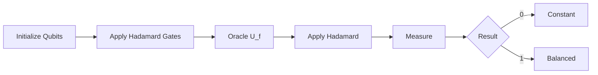
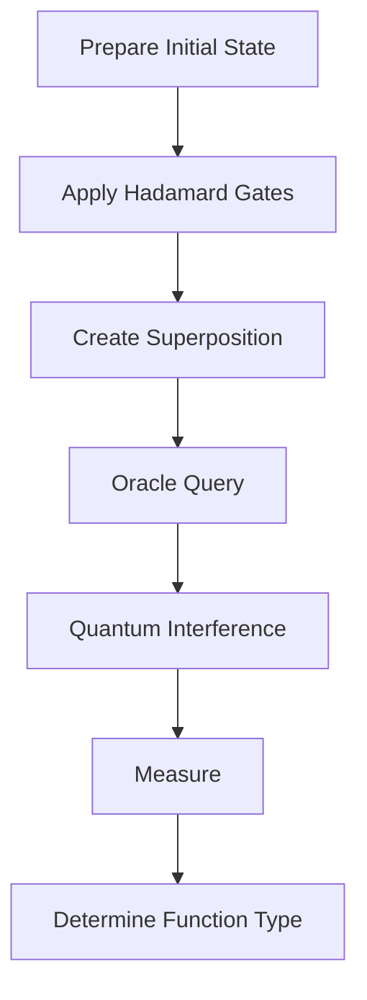
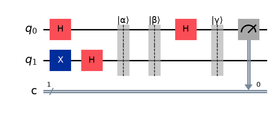
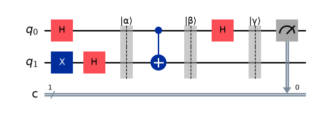
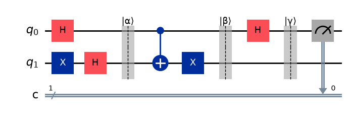
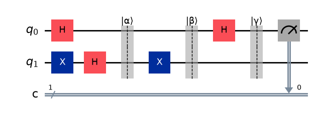

# Deutsch Algorithm

> Python implementation of the **Deutsch Algorithm** using **Qiskit**, demonstrating one of the earliest quantum algorithms and its computational advantage over the classical approach.


## Overview
The Deutsch algorithm is a toy algorithm serving as a 'proof of concept' that quantum computers can outperform classical computers on certain computational tasks.It lays the conceptual foundation for more advanced quantum algorithms, such as the Deutsch–Jozsa algorithm, Simon's algorithm, Shor's algorithm, and Grover's algorithm, which demonstrate increasingly significant quantum speedups.

---

## Table of Contents

- [Overview](#overview)
- [Problem Statement](#problem-statement)
- [Classical Solution](#classical-solution)
- [Quantum Solution](#quantum-solution)
- [Quantum Circuit](#quantum-circuit)
- [Algorithm](#algorithm)
- [Interpretation](#interpretation)
- [Workflow](#workflow)
- [Project Structure](#project-structure)
- [Requirements](#requirements)
- [Installation](#installation)
- [Running the Project](#running-the-project)
- [Example Output](#example-output)
- [Why It Matters](#why-it-matters)
- [References](#references)

---

# Overview

The **Deutsch Algorithm** is the first quantum algorithm to demonstrate that a quantum computer can solve a computational problem with fewer oracle queries than any classical deterministic algorithm.

The algorithm considers a Boolean function

```
f : {0,1} → {0,1}
```

and determines whether the function is

- **Constant** — both inputs produce the same output
- **Balanced** — the two inputs produce different outputs

A classical computer requires **two oracle queries** in the worst case, whereas the Deutsch Algorithm requires **only one**.

---

# Problem Statement

There are four possible Boolean functions.

| Function | f(0) | f(1) | Type |
|----------|:----:|:----:|------|
| f₀ | 0 | 0 | Constant |
| f₁ | 0 | 1 | Balanced |
| f₂ | 1 | 0 | Balanced |
| f₃ | 1 | 1 | Constant |

The objective is **not** to identify the exact function.

Instead, we only determine whether the function is **constant** or **balanced**.

---

# Classical Solution

A classical computer evaluates the function twice.

```text
Evaluate f(0)
      │
      ▼
Evaluate f(1)
      │
      ▼
Compare Outputs
      │
      ▼
Determine Function Type
```

**Worst-case oracle queries:** **2**

---

# Quantum Solution

The Deutsch Algorithm exploits

- Superposition
- Quantum interference
- Phase kickback

to determine the answer with **a single oracle query**.



---

# Quantum Circuit

The circuit implemented in this project is shown below.

> Replace this image after generating the circuit with Qiskit.

<p align="center">

</p>

---

# Algorithm

1. Initialize the qubits

```text
|ψ⟩ = |0⟩⊗|1⟩
```

2. Apply Hadamard gates to both qubits.

3. Apply the oracle

```text
U_f
```

4. Apply another Hadamard gate to the first qubit.

5. Measure the first qubit.

---

# Interpretation

| Measurement | Function Type |
|:-----------:|---------------|
| **0** | Constant |
| **1** | Balanced |

---

# Workflow



---

# Project Structure

```text
Deutsch-Algorithm/
│
├── deutsch_algorithm.py
├── trials_for_deutsch.ipynb
├── README.md
├── requirements.txt
├── LICENSE
├── .gitignore
└── images/
    └── deutsch_circuit.png
```

---

# Requirements

- Python 3.x
- Qiskit
- NumPy
- Matplotlib

---

# Installation

Clone the repository

```bash
git clone https://github.com/GautamaAditya/deutsch-algorithm.git
```

Move into the project directory

```bash
cd deutsch-algorithm
```

Install the required dependencies listed above.

---

# Running the Project

Run the implementation using

```bash
python deutsch_algorithm.py
```

Or execute the notebook

```text
trials_for_deutsch.ipynb
```
The Jupyter notebook also outputs the quantum state vector after each major part of the circuit

---

# Example Output

Balanced oracle

```text
Oracle: Balanced

Measurement:
{'1': 1}

Result:
The function is Balanced.
```

Constant oracle

```text
Oracle: Constant

Measurement:
{'0': 1}

Result:
The function is Constant.
```

The following figures show the output of the Deutsch algorithm for each of the four possible Boolean functions.

### Constant-0 function (Constant)

<p align="center">
  
</p>

### Identity function (Balanced)

<p align="center">
  
</p>

### NOT function (Balanced)

<p align="center">
  
</p>

### Constant-1 function (Constant)

<p align="center">
  
</p>

---

# Why It Matters

Although the Deutsch Algorithm solves a relatively simple problem, it introduced several ideas that became fundamental to quantum computing.

These include

- Quantum superposition
- Quantum parallelism
- Quantum interference
- Phase kickback
- Oracle-based computation

The algorithm also serves as the conceptual foundation for more advanced quantum algorithms such as

- Deutsch–Jozsa Algorithm
- Bernstein–Vazirani Algorithm
- Simon's Algorithm
- Grover's Algorithm
- Shor's Algorithm

---

# References

- David Deutsch, *Quantum Theory, the Church–Turing Principle and the Universal Quantum Computer* (1985)
- Michael A. Nielsen & Isaac L. Chuang, *Quantum Computation and Quantum Information*
- Qiskit Documentation

---

## Author

**Gautama Aditya**

Python implementation of the Deutsch Algorithm using **Qiskit** for educational purposes.