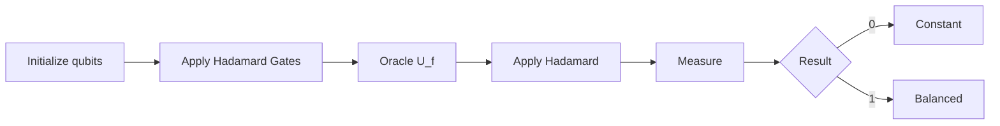

# Deutsch Algorithm

> Python implementation of the **Deutsch Algorithm** using **Qiskit**, demonstrating one of the earliest quantum algorithms and its computational advantage over the classical approach.

---

## Overview
The Deutsch algorithm is a toy algorithm serving as a 'proof of concept' that quantum computers can outperform classical computers on certain computational tasks.It lays the conceptual foundation for more advanced quantum algorithms, such as the Deutsch–Jozsa algorithm, Simon's algorithm, Shor's algorithm, and Grover's algorithm, which demonstrate increasingly significant quantum speedups.

Given a Boolean function

\[
f:\{0,1\}\rightarrow\{0,1\},
\]

the objective is to determine whether the function is:

- **Constant** — produces the same output for both inputs
- **Balanced** — produces different outputs for the two inputs

A classical computer requires **two evaluations** of the function in the worst case.

The Deutsch Algorithm solves the problem using **a single oracle query**.

---

# Problem Statement

There are four possible Boolean functions.

| Function | f(0) | f(1) | Type |
|----------|------|------|------|
| f₀ | 0 | 0 | Constant |
| f₁ | 1 | 1 | Constant |
| f₂ | 0 | 1 | Balanced |
| f₃ | 1 | 0 | Balanced |

The goal is **not** to determine the exact function.

Instead, we only want to determine whether it is **constant** or **balanced**.

---

# Classical Solution

A classical computer evaluates the function twice.

```text
Evaluate f(0)

↓

Evaluate f(1)

↓

Compare outputs

↓

Determine Constant or Balanced
```

Worst-case oracle queries:

```
2
```

---

# Quantum Solution

The Deutsch Algorithm exploits

- Superposition
- Quantum interference
- Phase kickback

to determine the answer with **one oracle query**.



---

# Quantum Circuit

The Deutsch circuit is

```text
          ┌───┐      ┌─────┐      ┌───┐ ┌─┐
|0> ──────┤ H ├──────┤ U_f ├──────┤ H ├─┤M├──
          └───┘      └─────┘      └───┘ └╥┘
                                         ║
|1> ──────┤ X ├──┤ H ├──────┤ U_f ├────────╫──
          └───┘  └───┘                     ║
                                           ║
Measurement ───────────────────────────────╩──
```

---

# Algorithm

1. Initialize

```
|ψ⟩ = |0⟩|1⟩
```

2. Apply Hadamard gates

```
H⊗H
```

3. Query the oracle

```
U_f
```

4. Apply another Hadamard gate to the first qubit.

5. Measure the first qubit.

---

# Interpretation

| Measurement | Function Type |
|-------------|---------------|
| 0 | Constant |
| 1 | Balanced |

---

# Workflow

```mermaid
graph TD

A[Prepare |0>|1>]
-->B[Apply Hadamards]

B-->C[Create Superposition]

C-->D[Oracle Query]

D-->E[Quantum Interference]

E-->F[Measure]

F-->G[Determine Function Type]
```

---

# Project Structure

```
Deutsch-Algorithm
│
├── deutsch.py
├── README.md
├── requirements.txt
├── .gitignore
└── images/
```

---

# Requirements

- Python 3.x
- Qiskit
- NumPy
- Matplotlib

Install the required packages:

```bash
pip install -r requirements.txt
```

---

# Running the Project

```bash
python deutsch.py
```

---

# Example Output

```text
Oracle: Balanced

Measurement:
{'1': 1024}

Result:
The function is Balanced.
```

or

```text
Oracle: Constant

Measurement:
{'0': 1024}

Result:
The function is Constant.
```

---

# Why It Matters

The Deutsch Algorithm was historically significant because it was the **first quantum algorithm** to demonstrate that quantum computation can outperform classical computation for a well-defined problem.

Although the problem itself is simple, the algorithm introduced several foundational concepts that appear throughout modern quantum computing, including:

- Superposition
- Quantum parallelism
- Phase kickback
- Quantum interference
- Oracle-based computation

These ideas form the basis for more advanced algorithms such as the Deutsch–Jozsa, Bernstein–Vazirani, Simon's, and Shor's algorithms.

---

# References

- David Deutsch, *Quantum Theory, the Church–Turing Principle and the Universal Quantum Computer* (1985)
- Qiskit Documentation
- Nielsen & Chuang, *Quantum Computation and Quantum Information*

---

## Author

**Gautama Aditya**

Python implementation of the Deutsch Algorithm using **Qiskit** for educational purposes.